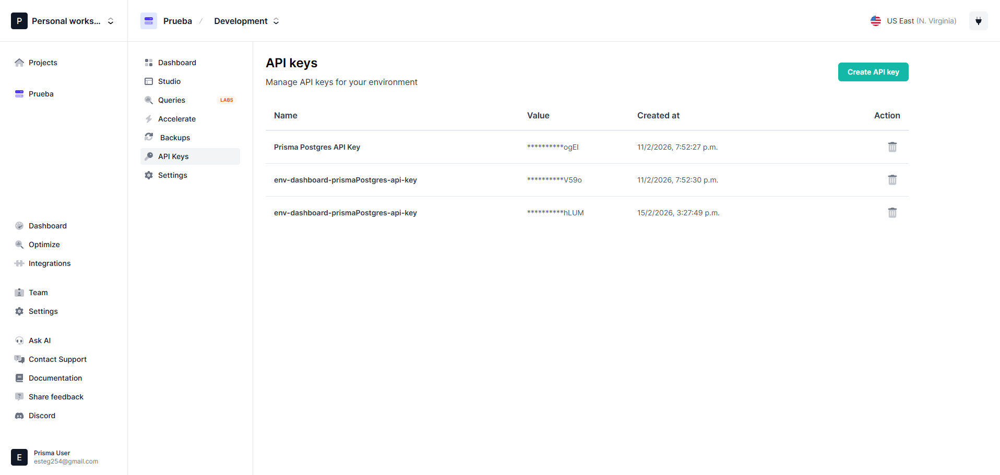
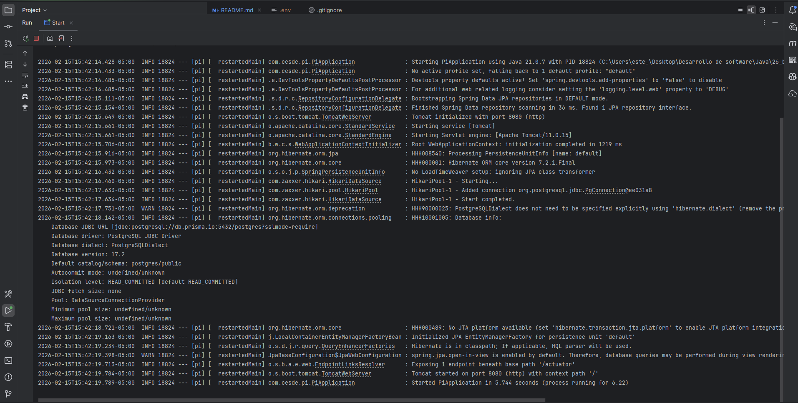
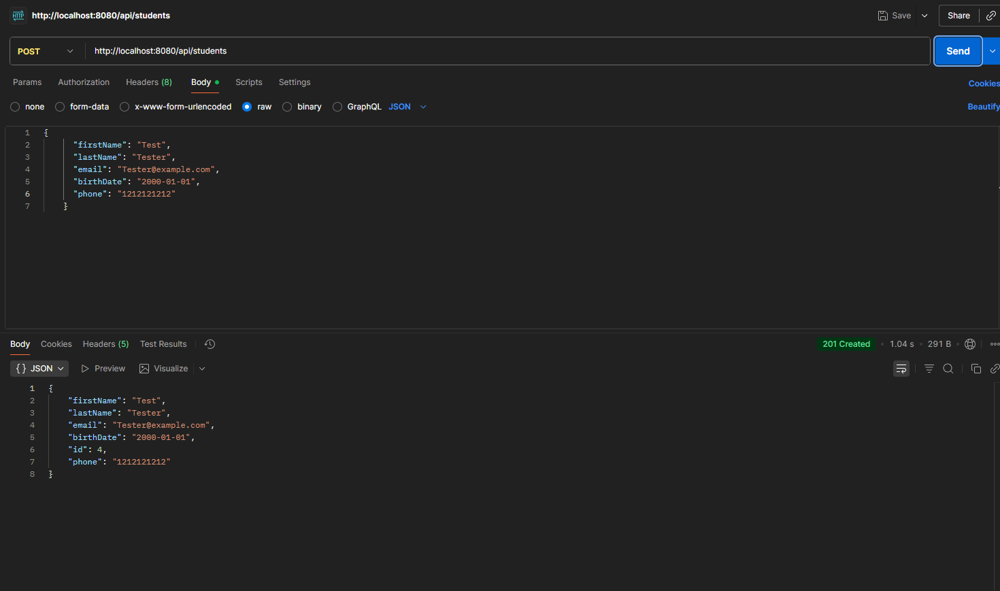
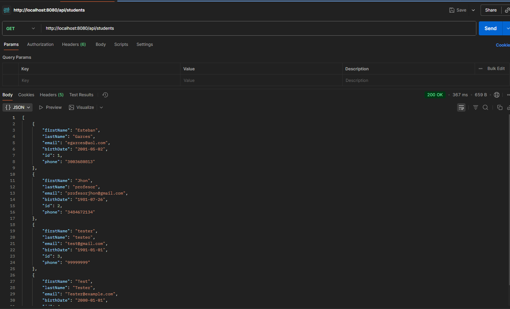
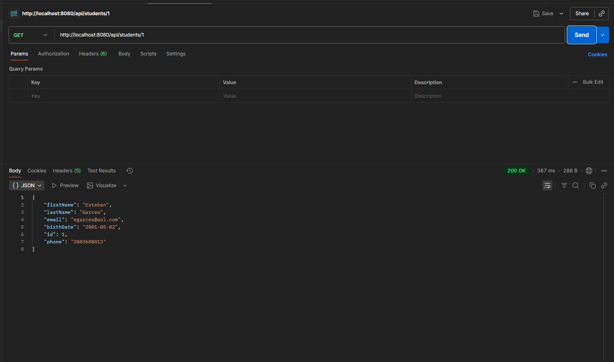
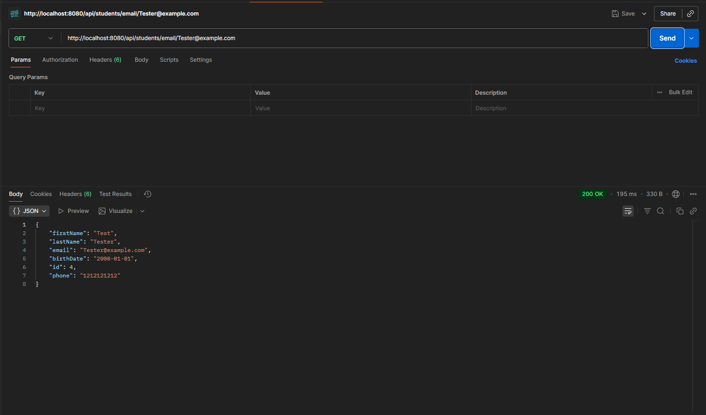
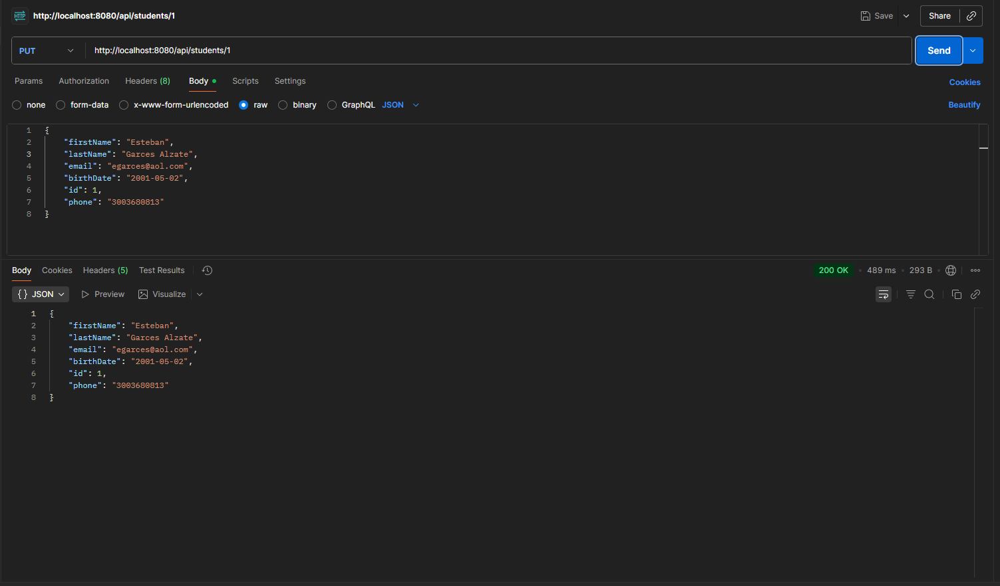
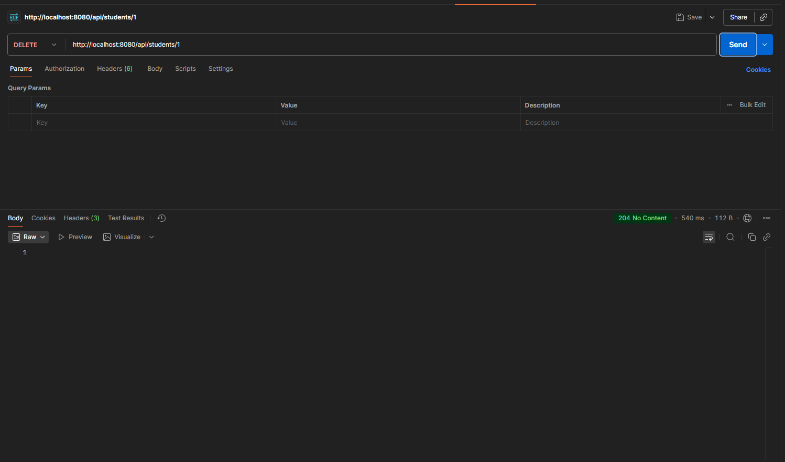
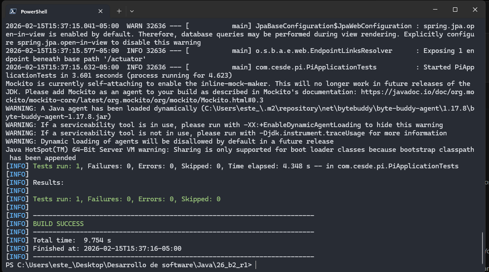

##  Actividad 1 - Configuración y Pruebas de Proyecto Spring Boot Esteban Garces Alzate

- **Captura de pantalla de la configuración de la base de datos en prisma.io**

- **Captura de pantalla del log de la consolo de Spring boot**

- **Evidencias de las pruebas CRUD**
- - **POST**

- - **GET All**

- - **Get by ID**

- - **GET BY EMAIL**

- - **PUT**

- - **DELETE**

- **Captura de pantalla del resultado de la ejecucion de las pruebas internas del proyecto**

